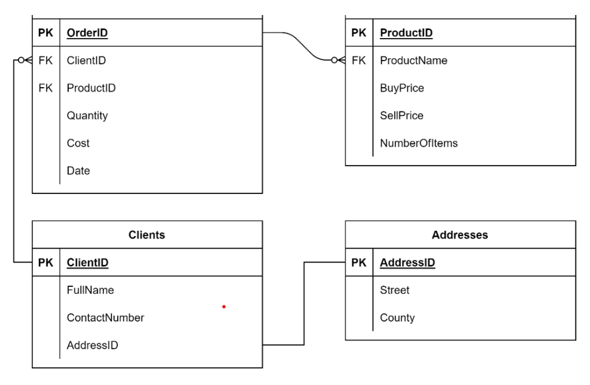
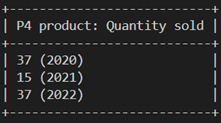
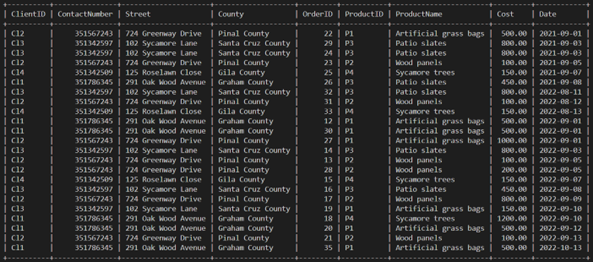

# Data analysis in MySQL

## Scenario

Lucky Shrub needs to perform data analysis to develop insights into the performance and progress of the business. They can carry out this task by analyzing the data contained within the Clients, Orders, Products and Addresses tables within their database, as shown in the following ER-Diagram:



Help Lucky Shrub to generate insights into their data by completing the tasks within this lab.

**Note:** Before you begin, make sure you know how to access [MySQL environment](https://www.coursera.org/learn/advanced-mysql-topics/supplement/Xp5Mg/how-to-access-mysql-environment).

### Prerequisites

To complete this lab, you must first make sure that the Lucky Shrub database and tables have been built within your MySQL environment.
The code to create the database and tables is as follows:

1.Create the database:

```SQL
CREATE DATABASE IF NOT EXISTS Lucky_Shrub;
```

2.Use database:

```SQL
USE Lucky_Shrub;
```

3.Create the tables:

```SQL
CREATE TABLE Clients (ClientID VARCHAR(10), FullName VARCHAR(100),  ContactNumber INT, AddressID INT);
```

```SQL
CREATE TABLE Orders (OrderID INT NOT NULL PRIMARY KEY, ClientID VARCHAR(10),  ProductID VARCHAR(10),  Quantity   INT, Cost DECIMAL(6,2), Date DATE);
```

```SQL
CREATE TABLE Products (ProductID VARCHAR(10), ProductName VARCHAR(100),  BuyPrice DECIMAL(6,2), SellPrice DECIMAL(6,2), NumberOfItems INT);
```

```SQL
CREATE TABLE Addresses(AddressID INT PRIMARY KEY, Street VARCHAR(255), County VARCHAR(100));
```

4.Populate the tables with data:

```SQL
INSERT INTO Clients(ClientID, FullName, ContactNumber, AddressID) VALUES
("Cl1", "Takashi Ito", 351786345, 1),
("Cl2", "Jane Murphy", 351567243, 2),
("Cl3", "Laurina Delgado", 351342597, 3),
("Cl4", "Benjamin Clauss", 351342509, 4),
("Cl5", "Altay Ayhan", 351208983, 5),
("Cl6", "Greta Galkina", 351298755, 6);
```

```SQL
INSERT INTO Orders (OrderID, ClientID, ProductID , Quantity, Cost, Date) VALUES
(1, "Cl1", "P1", 10, 500, "2020-09-01" ),
(2, "Cl2", "P2", 5, 100, "2020-09-05"),
(3, "Cl3", "P3", 20, 800, "2020-09-03"),
(4, "Cl4", "P4", 15, 150, "2020-09-07"),
(5, "Cl3", "P3", 10, 450, "2020-09-08"),
(6, "Cl2", "P2", 5, 800, "2020-09-09"),
(7, "Cl1", "P4", 22, 1200, "2020-09-10"),
(8, "Cl3", "P1", 15, 150, "2020-09-10"),
(9, "Cl1", "P1", 10, 500, "2020-09-12"),
(10, "Cl2", "P2", 5, 100, "2020-09-13"),
(11, "Cl4", "P5", 5, 100, "2020-09-15"),
(12, "Cl1", "P1", 10, 500, "2022-09-01"),
(13, "Cl2", "P2", 5, 100, "2022-09-05"),
(14, "Cl3", "P3", 20, 800, "2022-09-03"),
(15, "Cl4", "P4", 15, 150, "2022-09-07"),
(16, "Cl3", "P3", 10, 450, "2022-09-08"),
(17, "Cl2", "P2", 5, 800, "2022-09-09"),
(18, "Cl1", "P4", 22, 1200, "2022-09-10"),
(19, "Cl3", "P1", 15, 150, "2022-09-10"),
(20, "Cl1", "P1", 10, 500, "2022-09-12"),
(21, "Cl2", "P2", 5, 100, "2022-09-13"),
(22, "Cl2", "P1", 10, 500, "2021-09-01"),
(23, "Cl2", "P2", 5, 100, "2021-09-05"),
(24, "Cl3", "P3", 20, 800, "2021-09-03"),
(25, "Cl4", "P4", 15, 150, "2021-09-07"),
(26, "Cl1", "P3", 10, 450, "2021-09-08"),
(27, "Cl2", "P1", 20, 1000, "2022-09-01"),
(28, "Cl2", "P2", 10, 200, "2022-09-05"),
(29, "Cl3", "P3", 20, 800, "2021-09-03"),
(30, "Cl1", "P1", 10, 500, "2022-09-01");
```

```SQL
INSERT INTO Products (ProductID, ProductName, BuyPrice, SellPrice, NumberOfItems) VALUES
("P1", "Artificial grass bags ", 40, 50, 100),
("P2", "Wood panels", 15, 20, 250),
("P3", "Patio slates",  35, 40, 60),
("P4", "Sycamore trees ", 7, 10, 50),
("P5", "Trees and Shrubs", 35, 50, 75),
("P6", "Water fountain", 65, 80, 15);
```

```SQL
INSERT INTO Addresses (AddressID, Street, County) VALUES
(1, ",291 Oak Wood Avenue", "Graham County"),
(2, "724 Greenway Drive", "Pinal County"),
(3, "102 Sycamore Lane", "Santa Cruz County"),
(4, "125 Roselawn Close", "Gila County"),
(5, "831 Beechwood Terrace", "Cochise County"),
(6, "755 Palm Tree Hills", "Mohave County"),
(7, "751 Waterfall Hills", "Tucson County") ,
(8, "878 Riverside Lane", "Tucson County") ,
(9, "908 Seaview Hills", "Tucson County"),
(10, "243 Waterview Terrace", "Tucson County"),
(11, "148 Riverview Lane", "Tucson County"),
(12, "178 Seaview Avenue", "Tucson County");
```

#### There are two main objectives in this activity:

1.Analyze data to gain insight into Lucky Shrub’s business performance.

2.Query data from multiple tables.

### Tasks Instructions

Lucky Shrub need to evaluate the performance of their business by performing data analysis on their database tables. See if you can help them by performing the following tasks.

### Task 1

Lucky Shrub need to find out how many sycamore trees they’ve sold over the past few years. Sycamore trees have been assigned an ID of P4 in the products table in the database. Create a query that returns the total quantity of all products with the ID of P4 sold in the years 2020, 2021 and 2022. The expected output of the query must resemble the following screenshot:



### Task 2

Lucky Shrub need information on all their clients and the orders that they placed in the years 2022 and 2021. See if you can help them by extracting the required information from each of the following tables:

• Clients table: The client id and contact number for each client who placed an order

• Addresses table: The street and county for each client’s address

• Orders table: The order id, cost and date of each client’s order.

• Products table: The name of each product ordered.

The result set should be ordered by the “orders date” column as shown in the following screenshot.



### Task 3

Lucky Shrub needs to analyze the sales performance of their Patio slates product in the year 2021. This product has a Product ID of P3. Help Lucky Shrub to analyze the performance of this product by developing a function called “FindSoldQuantity” that enables them to:

• Input a ProductID and a year from which they can capture data

• And display the total quantity of the product sold in the given year.

For example, if Lucky Shrub enters a product id “P3” and the year “2021”, then the output result must be the same as the following screenshot:


